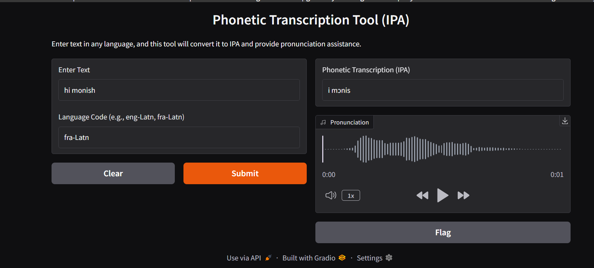

# Phonetic Transcription Tool (IPA) - README

## Overview
The Phonetic Transcription Tool converts text input into its corresponding International Phonetic Alphabet (IPA) representation and provides pronunciation assistance through audio playback.

## Features
- Converts text to IPA transcription.
- Supports multiple languages via language codes.
- Provides audio pronunciation of the transcribed text.

## How to Use
1. **Enter Text**: Input the text you want to transcribe.
2. **Enter Language Code**: Specify the language using its proper code (e.g., `eng-Latn` for English).
3. **Submit**: Click the 'Submit' button to generate the phonetic transcription.
4. **Listen**: Use the audio player to listen to the pronunciation.
5. **Clear**: Reset the input fields by clicking 'Clear'.

## Supported Language Codes
- `eng-Latn` (English - Latin script)
- `fra-Latn` (French - Latin script)
- `spa-Latn` (Spanish - Latin script)
- Other language codes may be supported depending on the backend.

## Screenshot


## Troubleshooting
### Error: "list index out of range"
Possible Causes:
- **Invalid Input**: Ensure the text is formatted correctly.
- **Unsupported Language Code**: Use a valid language code (e.g., `eng` instead of `eng-Latn`).
- **Empty Response**: The backend may not have returned a valid IPA transcription.
- **Backend Processing Error**: If the issue persists, check the backend logic handling transcription results.

## How to Run the Application
### Prerequisites
Ensure you have the following installed:
- Python (>= 3.8)
- Pip (Python package manager)

### Installation Steps
1. Clone the repository:
   ```sh
   git clone  https://github.com/MONISH-RAJ-T/Phonetic-Transcription.git 
   cd phonetic-transcription-tool
   ```
2. Install required dependencies:
   ```sh
   pip install -r requirements.txt
   ```
3. Run the application:
   ```sh
   python app.py
   ```

## Required Python Modules
The following modules are required and are listed in `requirements.txt`:
- `Flask` - For running the web application.
- `IPAphonetics` - For handling phonetic transcriptions.
- `SpeechRecognition` - For audio input and processing.
- `gTTS` - For generating pronunciation audio.

## How It Works
1. The user inputs text and selects the language code.
2. The backend processes the text and converts it into an IPA transcription using the `IPAphonetics` library.
3. If audio is required, the `gTTS` library generates pronunciation playback.
4. The output is displayed in the UI, and the user can listen to the pronunciation.

## Future Enhancements
- Support for additional languages.
- Improved error handling and user feedback.
- Offline mode for phonetic transcriptions.

For further assistance, contact support or check the backend logs for debugging.

